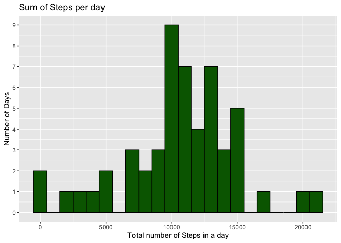
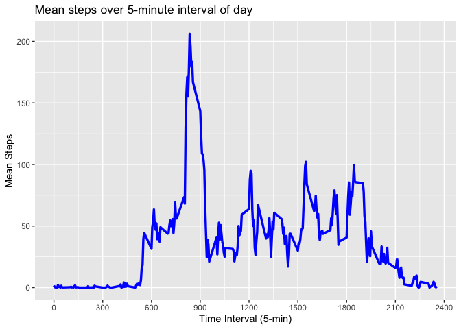
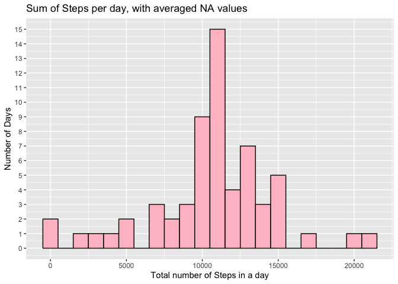
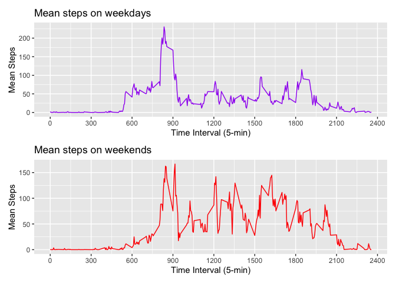

## Loading and preprocessing the data

First, it is required to unzip the data. The data set is in a zip in the Git repository so it's unnecessary to download a zip from the web. After unzipping, 
the file will be read into R.


```r
unzip("activity.zip")
activity<-read.csv("activity.csv")
```

Here are the first few rows of activity.csv, and a summary to see what the data
might look like. Str is also run here.


```r
head(activity)
```

```
##   steps       date interval
## 1    NA 2012-10-01        0
## 2    NA 2012-10-01        5
## 3    NA 2012-10-01       10
## 4    NA 2012-10-01       15
## 5    NA 2012-10-01       20
## 6    NA 2012-10-01       25
```

```r
summary(activity)
```

```
##      steps            date              interval     
##  Min.   :  0.00   Length:17568       Min.   :   0.0  
##  1st Qu.:  0.00   Class :character   1st Qu.: 588.8  
##  Median :  0.00   Mode  :character   Median :1177.5  
##  Mean   : 37.38                      Mean   :1177.5  
##  3rd Qu.: 12.00                      3rd Qu.:1766.2  
##  Max.   :806.00                      Max.   :2355.0  
##  NA's   :2304
```

```r
str(activity)
```

```
## 'data.frame':	17568 obs. of  3 variables:
##  $ steps   : int  NA NA NA NA NA NA NA NA NA NA ...
##  $ date    : chr  "2012-10-01" "2012-10-01" "2012-10-01" "2012-10-01" ...
##  $ interval: int  0 5 10 15 20 25 30 35 40 45 ...
```

It looks like the number of steps are recorded every five-minute interval.
The interval starts over each new day. Date is in chr format so it would be nice
if this was in date format. This is performed with the lubridate function ymd().
Then the date column will be removed and the ymd column will be renamed as date.


```r
library(lubridate)
```

```
## 
## Attaching package: 'lubridate'
```

```
## The following objects are masked from 'package:base':
## 
##     date, intersect, setdiff, union
```

```r
library(dplyr)
```

```
## 
## Attaching package: 'dplyr'
```

```
## The following objects are masked from 'package:stats':
## 
##     filter, lag
```

```
## The following objects are masked from 'package:base':
## 
##     intersect, setdiff, setequal, union
```

```r
activity$ymd<-ymd(activity$date)
activity<-select(activity, !(date))
activity<-rename(activity, date=ymd)
```

The data set has many points. This will tell us what the range of dates is:

```r
range(activity$date)
```

```
## [1] "2012-10-01" "2012-11-30"
```

So it looks like the range is two months (October and November of 2012). 
For ease of use, let's define interval, steps, and date as
vectors. 


```r
interval<-activity$interval
steps<-activity$steps
date<-activity$date
```


## What is mean total number of steps taken per day?

Now to check how many dates have NA values, tapply will be run for the sum of 
steps in a day. This will be done twice, with and without the na.rm=TRUE 
argument to understand the NA nature of the data more clearly. Both results will
be put into a new dataframe sum_steps along with a column for the date and 
columns will be appropriately named. Using this data frame, a histogram that
shows the sum of steps each day can be created using ggplot2. Below this, the
mean and median are calculated.


```r
library(dplyr)
library(ggplot2)
date_single<-unique(date)
sum_withna<-tapply(steps,date,sum)
sum_w_o_na<-tapply(steps, date, sum, na.rm=TRUE)
sum_steps<-data.frame(sum_withna, sum_w_o_na, date_single)
sum_steps<-rename(sum_steps, Sum_NA=sum_withna, Sum_0=sum_w_o_na, date=date_single)
histogram<-ggplot(sum_steps, aes(x=Sum_NA))+geom_histogram(binwidth=1000, color="black", fill="darkgreen")+ylab("Number of Days")+xlab("Total number of Steps in a day")+ggtitle("Sum of Steps per day")+scale_y_continuous(breaks=seq(0,10,by=1))
histogram
```

```
## Warning: Removed 8 rows containing non-finite outside the scale range
## (`stat_bin()`).
```

<!-- -->

```r
mean<-mean(sum_steps$Sum_NA, na.rm=TRUE)
median<-median(sum_steps$Sum_NA, na.rm=TRUE)
```

The mean number of steps taken per day is 1.0766189\times 10^{4}. The median number of steps
taken per day is 10765.

## What is the average daily activity pattern?

As we did with the sum of steps per day, now it should be calculated the mean
number of steps for each interval period (across all days). Again, tapply will
be used here. The interval associated with each mean will be added as done 
before with adding the date, and the columns will be renamed for coherency.


```r
avg_interval<-tapply(steps, interval, mean, na.rm=TRUE)
interval_single<-unique(interval)
avg_interval<-data.frame(avg_interval, interval_single)
avg_interval<-rename(avg_interval, mean_steps=avg_interval, interval=interval_single)
```

Then the time series plot can be constructed:


```r
timeseries<-ggplot(avg_interval, aes(interval, mean_steps))+geom_line(color="blue", lwd=1.2)+labs(x="Time Interval (5-min)", y="Mean Steps")+ggtitle("Mean steps over 5-minute interval of day")+scale_x_continuous(breaks=seq(0,2400, by=300))
timeseries
```

<!-- -->

What time interval has the highest average number of steps?

```r
max<-rownames(avg_interval)[which.max(avg_interval$mean_steps)]
```

The interval 835 has the highest average number of steps. 8:30AM is the time with the highest average number of steps.


## Imputing missing values

From a previous question, we can calculate the number of missing values int the dataset. 


```r
no_data<-table(is.na(activity$steps))
no_data
```

```
## 
## FALSE  TRUE 
## 15264  2304
```

So, there are 2304 missing values in the dataset. Looking back at the 
sum_steps data.frame, it seems that there are entire days with NA values, so 
it doesn't make sense to use the mean/median of that day to replace the NA 
values if the rest of the values during that day are NA. It makes more sense to 
use the average steps from that time interval. There are 2304 NA values, and 
288 intervals in a day. Therefore there are eight full days that are missing 
step recording information. These days are:


```r
missing_dates<-rownames(sum_steps)[which(sum_steps$Sum_0==0)]
missing_dates
```

```
## [1] "2012-10-01" "2012-10-08" "2012-11-01" "2012-11-04" "2012-11-09"
## [6] "2012-11-10" "2012-11-14" "2012-11-30"
```


I'm trying to create a dataframe with the missing values. Then I'll rearrange 
them so the columns are in the same order as the activity data frame and combine 
the two data frames. Then I use na.omit to remove the NA values from the original
data frame. Finally, I arrange the new data frame by date, then interval.


```r
missing_int<-data.frame(rep(missing_dates, 288))
missing_int<-arrange(missing_int, missing_int)
missing_int<-data.frame(missing_int, mean_steps=avg_interval$mean_steps, interval=avg_interval$interval)
missing_int<-rename(missing_int, date=rep.missing_dates..288.)
missing_int<-select(missing_int, mean_steps, date, interval)
missing_int<-rename(missing_int, steps=mean_steps)
combined_activity<-rbind(activity, missing_int)
activity_mod<-na.omit(combined_activity)
activity_mod<-arrange(activity_mod, date, interval)
```

Now, to create a new histogram for the total steps per day with imputed values:


```r
interval2<-activity_mod$interval
steps2<-activity_mod$steps
date2<-activity_mod$date
sum_steps_mod<-tapply(steps2, date2, sum)
sum_steps_mod<-data.frame(sum_steps_mod, date_single)
histogram2<-ggplot(sum_steps_mod, aes(x=sum_steps_mod))+geom_histogram(binwidth=1000, color="black", fill="pink")+ylab("Number of Days")+xlab("Total number of Steps in a day")+ggtitle("Sum of Steps per day, with averaged NA values")+scale_y_continuous(breaks=seq(0,16,by=1))
histogram2
```

<!-- -->

What are the mean and median of this new data set?


```r
mean2<-mean<-mean(sum_steps_mod$sum_steps_mod)
median2<-median<-median(sum_steps_mod$sum_steps_mod)
```

The mean number of steps taken per day is 1.0766189\times 10^{4}. The median number of steps
taken per day is 1.0766189\times 10^{4}. The new mean and median are equal to the sum of the mean steps per time interval over a day. The new histogram looks more normal, however with eight of 61 days using "imputed" data, this is narrowing the bell curve of the original data set notably. The mean and median are not shifted much from the original dataset which excluded NA values. 

## Are there differences in activity patterns between weekdays and weekends?

Changing the date to date format in the activity_mod dataset, and then adding the weekday abbreviation in a new column. Finally, I'll make two subsets (weekday and weekend).

```r
activity_mod$ymd<-ymd(activity_mod$date)
activity_mod<-select(activity_mod, !(date))
activity_mod<-rename(activity_mod, date=ymd)
activity_mod$weekday<-weekdays(activity_mod$date, abbreviate = TRUE)
subset_weekday<-filter(activity_mod, weekday=="Mon" | weekday=="Tue" | weekday=="Wed"| weekday=="Thu"| weekday=="Fri")
subset_weekend<-filter(activity_mod, weekday=="Sat" | weekday=="Sun")
```

After making the two subsets, I'll run tapply to find the average steps for each
interval and plot them as I did for "timeseries".


```r
steps_weekday<-subset_weekday$steps
int_weekday<-subset_weekday$interval
steps_weekend<-subset_weekend$steps
int_weekend<-subset_weekend$interval
avg_weekday<-tapply(steps_weekday,int_weekday,mean)
avg_weekday<-data.frame(avg_weekday, interval_single)

avg_weekend<-tapply(steps_weekend, int_weekend, mean)
avg_weekend<-data.frame(avg_weekend, interval_single)

day<-ggplot(avg_weekday, aes(interval_single, avg_weekday))+geom_line(color="purple")+labs(x="Time Interval (5-min)", y="Mean Steps")+ggtitle("Mean steps on weekdays")+scale_x_continuous(breaks=seq(0,2400, by=300))

end<-ggplot(avg_weekend, aes(interval_single, avg_weekend))+geom_line(color="red")+labs(x="Time Interval (5-min)", y="Mean Steps")+ggtitle("Mean steps on weekends")+scale_x_continuous(breaks=seq(0,2400, by=300))

library(patchwork)
day/end
```

<!-- -->

Weekdays appear to begin with a higher mean number of steps, and then over the day there are fewer steps recorded. Steps recorded are generally higher over the course of the day on weekends.
